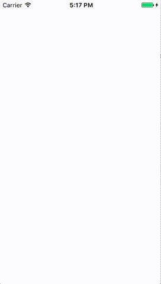

使用 CABasicAnimation 动画自定义的属性：


```objc
#import <QuartzCore/QuartzCore.h>

@interface TTPieSliceLayer : CAShapeLayer

@property (nonatomic) CGFloat startAngle;
@property (nonatomic) CGFloat endAngle;

- (void)startRotating;

@end

@implementation TTPieSliceLayer

// ^注1
// http://www.nomadplanet.fr/2010/11/animate-calayer-custom-properties-with-coreanimation/
// http://stackoverflow.com/questions/2395382/animating-a-custom-property-of-calayer-subclass
+ (BOOL)needsDisplayForKey:(NSString *)key {
    return [key isEqualToString:@"startAngle"]
        || [key isEqualToString:@"endAngle"]
        || [super needsDisplayForKey:key];
}

- (void)drawInContext:(CGContextRef)ctx {
    CGPoint center = CGPointMake(self.bounds.size.width / 2, self.bounds.size.height / 2);
    CGFloat radius = MIN(self.bounds.size.width, self.bounds.size.height) / 2;

    UIBezierPath *path = [UIBezierPath bezierPathWithArcCenter:center radius:radius startAngle:_startAngle endAngle:_endAngle clockwise:YES];
    [path addLineToPoint:center];
    [path closePath];

    CGContextAddPath(ctx, path.CGPath);
    CGContextSetFillColorWithColor(ctx, self.fillColor);
    CGContextFillPath(ctx);
}

- (CABasicAnimation *)makeAnimationForKeyPath:(NSString *)keyPath {
    CABasicAnimation *anim = [CABasicAnimation animationWithKeyPath:keyPath];
    anim.fromValue = @0;
    anim.toValue = [self valueForKey:keyPath];
    anim.duration = 1;
    anim.timingFunction = [CAMediaTimingFunction functionWithName:kCAMediaTimingFunctionEaseInEaseOut];
    return anim;
}

- (void)startRotating {
    [self addAnimation:[self makeAnimationForKeyPath:@"startAngle"] forKey:@"startAngle"];
    [self addAnimation:[self makeAnimationForKeyPath:@"endAngle"] forKey:@"endAngle"];
}

@end
```
[完整代码](https://github.com/shyang/PieChart/blob/simplest/TTPieSliceLayer.m)

注1: CABasicAnimation 缺省不支持自定义的属性，需要覆盖 +[CALayer needsDisplayForKey]


扩展：加上百分比：



[完整代码](https://github.com/shyang/PieChart/blob/master/TTPieSliceLayer.m)
